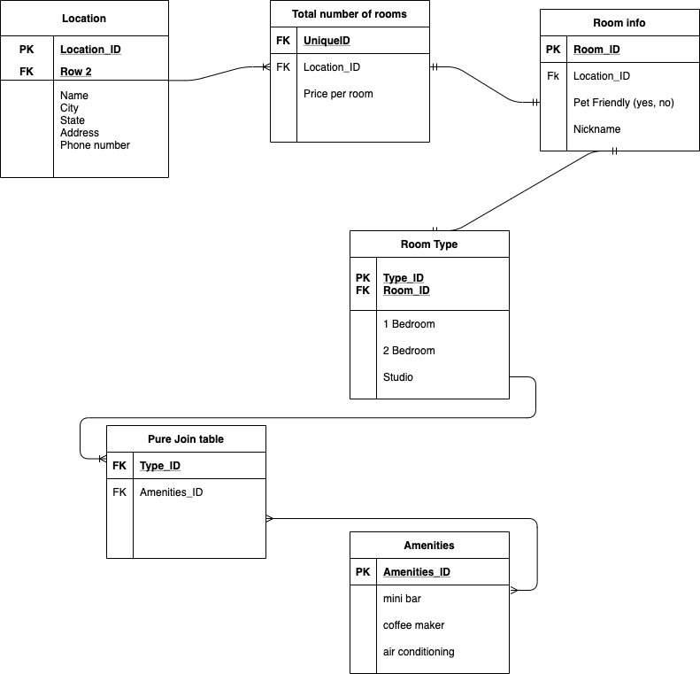

# AsyncInn

1.The name of your project
Async Inn ERD
2.Your Name
Christian Lievrouw
3.Today’s date
09/08/1993
4. Table info
    - Location table holds info that each location will have such ad name, city, state, address, ect.
    - Total number of rooms table says that each location has only a certain amount of rooms
    - Room info table is a table for all the nessarary things each room will have regarless of size
    - Room Type table says if a room is a 1 bedroom, 2 bedroom, or studio
    - pure join tabel joins room type table with Amenities table because each type of room has relation to certain amenities

